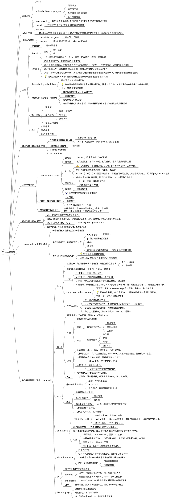
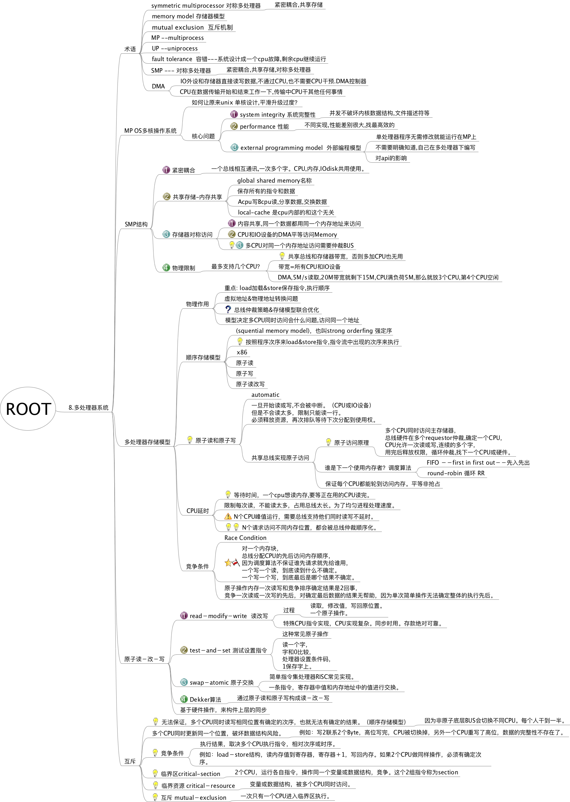
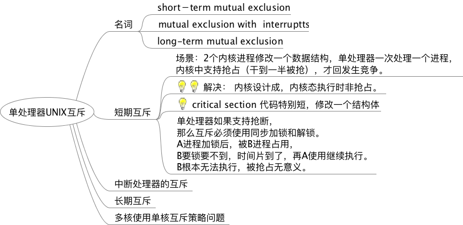

# 内核程序员的对称多处理器和缓存技术 笔记
2015-10月～11月

##第一章 UNIX内核原理

##第八章 多处理器系统

##后续参考书

多处理器编程的艺术（修订版） 
MIT
<http://book.douban.com/subject/3182112/>

多核应用编程实战
<http://book.douban.com/subject/24530911/>

C++多核高级编程 (美)休斯
<http://book.douban.com/subject/4770590/>

英特尔酷睿微体系结构
<http://baike.baidu.com/view/2798310.htm?fromtitle=%E5%BE%AE%E4%BD%93%E7%B3%BB%E7%BB%93%E6%9E%84&fromid=10230883&type=syn>

